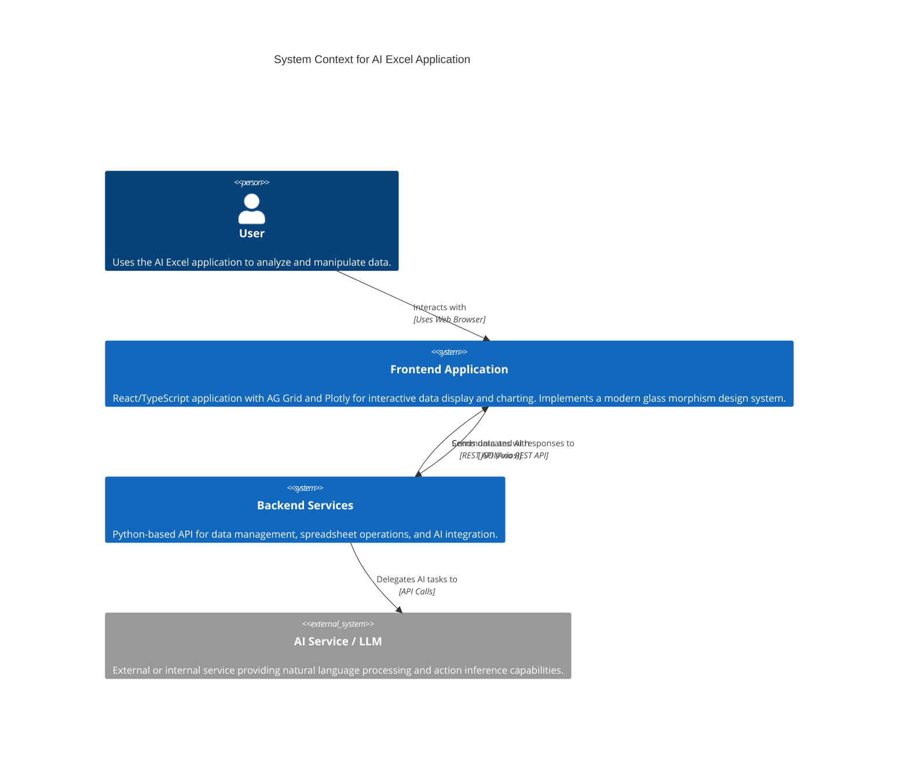

# AI Excel Spreadsheet Application

## Overview

[](https://www.python.org/)
[](https://fastapi.tiangolo.com/)
[](https://react.dev/)
[](https://www.typescriptlang.org/)
[](https://tailwindcss.com/)
[](https://vitejs.dev/)
[](https://www.ag-grid.com/)
[](https://plotly.com/javascript/)
[](https://opensource.org/licenses/MIT)

This project is an AI-powered spreadsheet application designed to provide an interactive and intuitive user experience for data analysis and manipulation. It features a conversational AI interface that allows users to perform complex operations on their data using natural language, along with a robust data grid and charting capabilities.

## Screenshots
<!-- Add your actual screenshots here -->
A visual demonstration of the AI Excel application in action.

**Main Interface**


**Diagrams/Plots**


## Features

### Core Functionality
- **AI-Powered Chat Interface**: Interact with your data using natural language commands (e.g., "add a column for profit = revenue - cost", "highlight rows where profit < 0").
- **Dynamic Spreadsheet Grid**: Built with AG Grid, providing a feature-rich, high-performance data table.
- **Data Import/Export**: Easily import CSV and Excel files.
- **Computed Columns**: Create new columns based on expressions.
- **Row & Column Management**: Add new rows and empty columns.
- **Interactive Plotting**: Generate various charts and diagrams based on data insights, integrated with Plotly.js.
- **Real-time Updates**: Changes made through the AI or manual edits are reflected instantly.

### Design System (Frontend)
The frontend boasts a clean, professional, and cohesive design system with a modern glass morphism aesthetic.

**Key Design Principles:**
- **Consistency**: Unified styling across all components.
- **Visual Hierarchy**: Clear distinction between primary, secondary, and tertiary elements.
- **Accessibility**: WCAG AA compliant contrast ratios and clear focus states.
- **Smooth Interactions**: Subtle transitions and tactile feedback.

**Design Tokens:**
- **Color Palette**: Primary Indigo (600-700), Secondary Slate, Accent Blue, Semantic colors (Success, Warning, Error).
- **Spacing System**: Standardized gaps and padding for predictable layouts.
- **Typography**: Optimized font sizes and weights for readability.
- **Border Radius**: Consistent rounding for a modern look.

**Component Standardization:**
- **Buttons**: 5 variants (Primary, Secondary, Tertiary, Ghost, Danger) with consistent sizing, padding, and hover/active states.
- **Input Fields**: Light and dark themes for consistent user input.
- **Tabs**: Clear active/inactive states with badge support.
- **Chat Bubbles**: Distinct styling for user and assistant messages.

**Visual Enhancements:**
- **Glass Morphism**: Dark effect for the chat panel, light effect for the sheet/diagrams area, providing depth and elegance.
- **Custom Scrollbars**: Improved aesthetics for scrollable areas.
- **AG Grid Theming**: Fully customized to integrate seamlessly with the application's visual language, including intelligent row highlighting.

## Application Architecture



## Technologies Used

### Frontend
- **React**: A JavaScript library for building user interfaces.
- **TypeScript**: Statically typed superset of JavaScript.
- **Vite**: Fast development build tool.
- **Tailwind CSS**: A utility-first CSS framework for rapid UI development.
- **AG Grid**: Advanced data grid for React.
- **Plotly.js**: JavaScript graphing library for interactive charts.
- **Axios**: Promise-based HTTP client.

### Backend
- **Python**: Core programming language for backend services.
- **FastAPI**: Modern, fast (high-performance) web framework for building APIs with Python.
- Data processing libraries (e.g., Pandas for spreadsheet operations)
- AI/ML libraries (e.g., for natural language processing and action inference)

## Getting Started

### Prerequisites

- Node.js (v18+) and npm
- Python (v3.8+) (for backend, if applicable)

### Installation

1. **Clone the repository:**
   ```bash
   git clone [repository_url]
   cd ai-excel
   ```

2. **Frontend Setup:**
   ```bash
   cd frontend
   npm install
   ```

3. **Backend Setup:**
   *(Instructions depend on backend implementation. Assuming a Python backend for now.)*
   ```bash
   cd ../backend
   pip install -r requirements.txt # (assuming a requirements.txt exists)
   # Or install dependencies manually if known
   ```

### Running the Application

1. **Start the Backend Server:**
   *(Example for a common Python setup)*
   ```bash
   cd backend
   uvicorn app.main:app --reload
   ```

2. **Start the Frontend Development Server:**
   Open a new terminal.
   ```bash
   cd frontend
   npm run dev
   ```
   The frontend application will typically open in your browser at `http://localhost:5174` (or another available port).

## Project Structure

```
.
├── backend/                  # Backend services and API
│   ├── app/
│   │   ├── main.py           # Main backend application
│   │   ├── models/           # Data models (schemas.py)
│   │   ├── routes/           # API endpoints (api.py)
│   │   └── services/         # Business logic (ai_service.py, data_service.py)
│   └── ...
├── frontend/                 # Frontend React application
│   ├── public/               # Static assets
│   ├── src/
│   │   ├── App.tsx           # Main application component
│   │   ├── index.css         # Global styles and design system
│   │   ├── main.tsx          # Entry point
│   │   ├── components/       # Reusable UI components
│   │   │   ├── ChatPanel.tsx
│   │   │   ├── SheetGrid.tsx
│   │   │   ├── DiagramGallery.tsx
│   │   │   └── PlotViewer.tsx
│   │   ├── lib/              # API clients and utilities
│   │   └── types/            # TypeScript type definitions
│   ├── package.json          # Frontend dependencies and scripts
│   └── tailwind.config.js    # Tailwind CSS configuration
├── scripts/                  # Utility scripts
├── DESIGN_SYSTEM.md          # Detailed documentation of the design system
└── README.md                 # Project README
```

## Contributing

Contributions are welcome! Please follow these steps:
1. Fork the repository.
2. Create a new branch for your feature or bug fix.
3. Implement your changes.
4. Ensure tests pass and code adheres to style guidelines.
5. Submit a pull request.

## License

This project is licensed under the MIT License.
